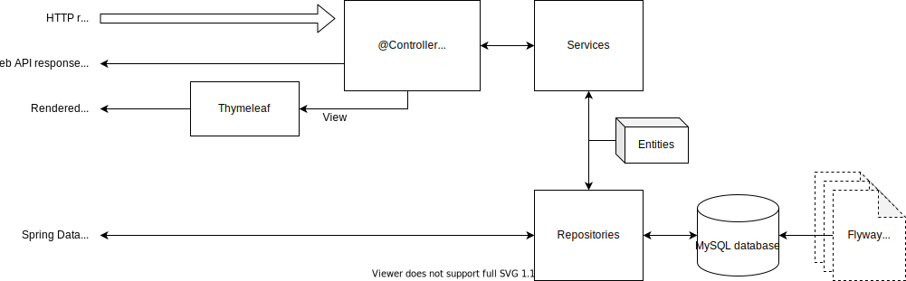

# Haru webapp template
This is a template for a web application using Spring boot, flyway and thymelea.

## Technology stack

The application is made with the technologies below:

### Spring-boot (and Maven)
Spring Boot (including Spring Web MVC and Spring Data JPA) is an app framework for making web apps, it does a lot of things for us.

### Flyway
Flyway handle automatically setting up and upgrading the database schema for us.

### Thymeleaf
Thymeleaf is a template engine that generates HTML pages from templates, that we can use to make dynamic pages.

## Diagram of the architecture of the application 

## Dependencies
* **Spring Boot DevTools** DEVELOPER TOOLS
Provides fast application restarts, LiveReload, and configurations for enhanced development experience.
* **Spring Web** WEB Build web, including RESTful, applications using Spring MVC. Uses Apache Tomcat as the default embedded container.
* **Rest Repositories HAL Explorer** WEB Browsing Spring Data REST repositories in your browser.
* **Thymeleaf** TEMPLATE ENGINES A modern server-side Java template engine for both web and standalone environments. Allows HTML to be correctly displayed in browsers and as static prototypes.
* **Spring Data JPA** SQL persist data in SQL stores with Java Persistence API using Spring Data and Hibernate.
* **Flyway Migration** SQL Version control for your database so you can migrate from any version (incl. an empty database) to the latest version of the schema.
* **MySQL Driver** SQL MySQL JDBC and R2DBC driver.
* **Spring Boot Actuator** OPS Supports built in (or custom) endpoints that let you monitor and manage your application - such as application health, metrics, sessions, etc.
* **H2 Database** SQL Provides a fast in-memory database that supports JDBC API and R2DBC access, with a small (2mb) footprint. Supports embedded and server modes as well as a browser based console application.

## What's in the project

* `SimpleController` has two methods: one is an example of a web service API that returns JSON, the other is an example of
  using Thymeleaf to return an HTML web page.
* `WeatherService` is an example of a simple business logic service that talks to a database
* The `dto` package contains Data Transfer Object classes for using in the web service API
* The `persistence` package has examples of an entity and repository for communicating with the database
* The `exceptions` package has an example of a custom exception.
* `resouces/db/migration` contains the Flyway scripts for initializing the database schema.
* `resources/templates` contains HTML template files for Thymeleaf.
* `application.properties` contains properties for connecting to the database.
* `test` contains tests for all the classes, and SQL for setting up the test database.

## Missing explain TDD/BDD and Dev cycle
Add graph with TDD and BDD and more frameworks

## Missing general deployment documentation
